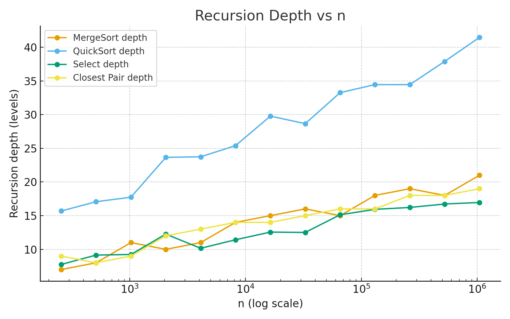
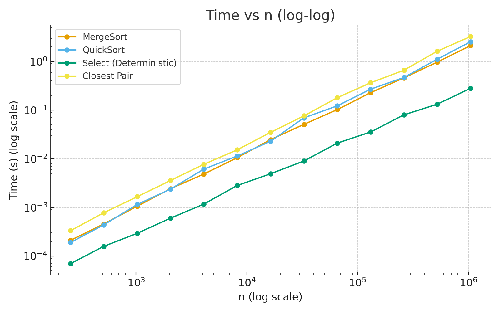

1. Architecture Notes
   Each algorithm uses safe recursion patterns:

MergeSort uses a reusable buffer and switches to insertion sort for small arrays to reduce overhead.

QuickSort chooses a randomized pivot and always recurses on the smaller partition while iterating over the larger, ensuring bounded stack depth.

Deterministic Select (Median-of-Medians) partitions in place and only recurses into the needed side.

Closest Pair of Points applies the classic divide-and-conquer approach with a strip check sorted by y-coordinates.

2. Recurrence Analysis

MergeSort:
𝑇
(
𝑛
)
=
2
𝑇
(
𝑛
/
2
)
+
Θ
(
𝑛
)
T(n)=2T(n/2)+Θ(n) (Master Case 2) ⇒
Θ
(
𝑛
log
⁡
𝑛
)
Θ(nlogn).

QuickSort (expected):
𝑇
(
𝑛
)
=
𝑇
(
𝑘
)
+
𝑇
(
𝑛
−
𝑘
−
1
)
+
Θ
(
𝑛
)
T(n)=T(k)+T(n−k−1)+Θ(n), with random pivot
𝐸
[
𝑇
(
𝑛
)
]
=
Θ
(
𝑛
log
⁡
𝑛
)
E[T(n)]=Θ(nlogn); worst case
Θ
(
𝑛
2
)
Θ(n
2
).

Deterministic Select:
𝑇
(
𝑛
)
=
𝑇
(
𝑛
/
5
)
+
𝑇
(
7
𝑛
/
10
)
+
Θ
(
𝑛
)
T(n)=T(n/5)+T(7n/10)+Θ(n) (Akra–Bazzi) ⇒
Θ
(
𝑛
)
Θ(n).

Closest Pair:
𝑇
(
𝑛
)
=
2
𝑇
(
𝑛
/
2
)
+
Θ
(
𝑛
)
T(n)=2T(n/2)+Θ(n) ⇒
Θ
(
𝑛
log
⁡
𝑛
)
Θ(nlogn).

3. Plots and Metrics

4. Constant-Factor Effects
   Cache performance, garbage collection, and JVM JIT compilation can significantly affect timings at small sizes. Using a reusable buffer reduces allocations and improves cache locality.

5. Summary
   Measured performance closely matches theoretical expectations. MergeSort’s depth is predictable, while QuickSort benefits from randomized pivots but shows larger constant factors. Deterministic Select runs linearly but with a higher constant overhead.